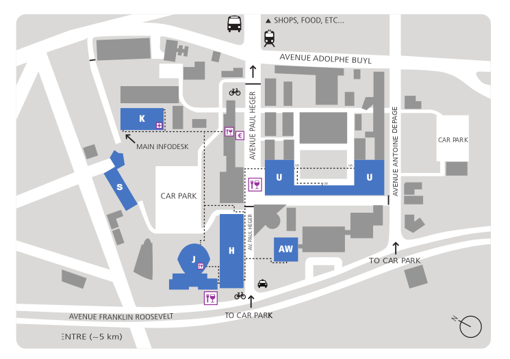

Just as the year closes, it's time to remind people that two fantastic events
are going to take place at the end of January / the beginning of February:

# FOSDEM 2020

FOSDEM is *the* Free- and Open Source conference in Europe! GNU Radio has had a
strong presence there for the last few years, and 2020 will be no different.
Whilst you can be sure to find GNU Radio users and developers sitting and
actively partaking in a lot of relevant tracks (Embedded, Policy, IoT, Python,
...), the concentration of SDR content in the [Free Software
Radio](https://fosdem.org/2020/schedule/track/free_software_radio/) makes it
impossible for a lot of us to miss that session. The session organizers have
gone through lengths to make sure that room has a good mixture of topics, and
isn't focused on GNU Radio alone – check out the schedule.

FOSDEM happens anually at the ULB campus in Brussels, Belgium, and is free for
anyone. Its multitude of small session rooms makes it the perfect event to
watch exactly the talks one is interested in, whilst meeting the main figures
behind your favourite open source project. We're looking forward to having a
chat with you in Brussels!

 Map CC-BY-2.0 FOSDEM

## Last year's recordings

If you're not sure what is expecting you: good news! 

You can last year's [schedule in the FOSDEM 2019
archive](https://archive.fosdem.org/2019/schedule/track/free_software_radio/),
and that includes video recordings!

# Pre-FOSDEM Hackfest at ESA ESTEC in Noordwijk

Nordwijk has a high concentration of communications engineers – and not the
least of these is Andrej Rode, who's been a long-term pillar of GNU Radio! He's
gone through lengths to organize the *Pre-FOSDEM GNU Radio Hackfest 2020 at
ESA/ESTEC*.

It takes places January 28 to January 30, giving you enough time to get to see
the beautiful city of Leiden, the space museum, and enjoy a fair bit of ESA
atmosphere!

It'll concern itself with compute infrastructure, metadata tools, build chains
and CI systems, or whatever we find workgroups for. You'll definitely want to
read the [wiki page](https://wiki.gnuradio.org/index.php/Hackfest2001) and get
up to speed on what you can do and contribute!

This is a limited headcount event – the free
[tickets](https://tickets.gnuradio.org/hackfest2001/) are running low, so if
you can and want to contribute to GNU Radio and its ecosystem, do hurry up.

